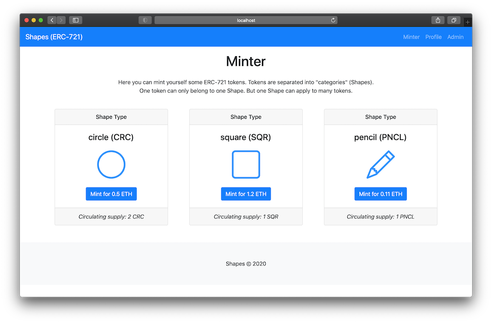
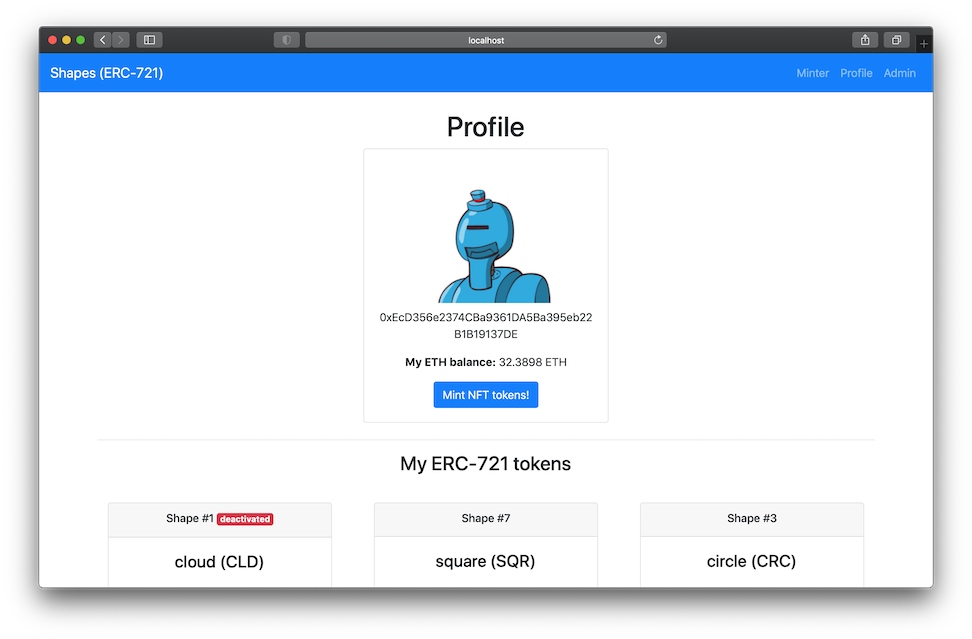
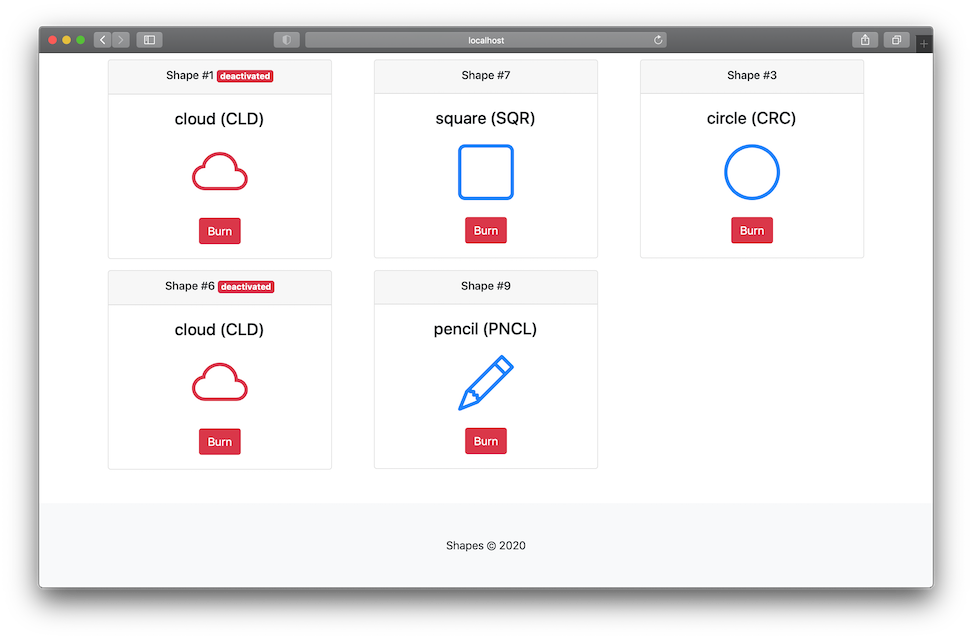
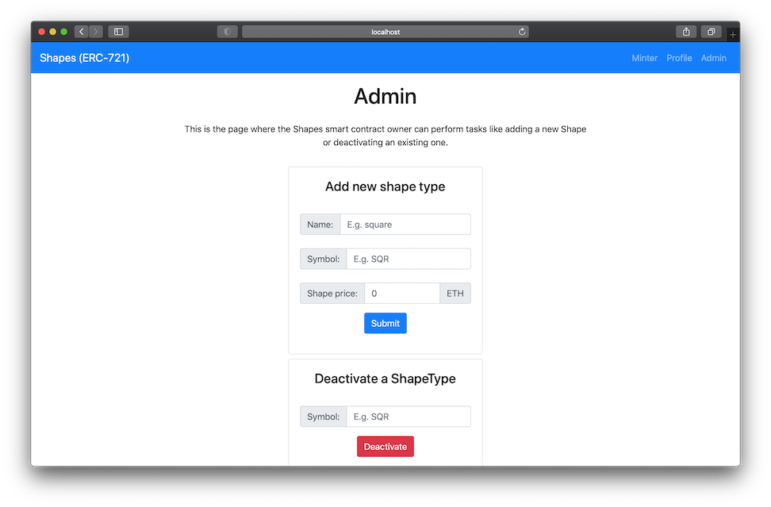

I am practicing and learning from https://github.com/remote-gildor/vue-drizzle-erc-721-example
-----------------------
# An ERC-721 example made with Truffle, Drizzle, and Vue

An ERC-721 where the NFT token can be separated into multiple categories (shapes):

- circles
- squares
- triangles
- etc. (contract owner can create new categories)

The example is **similar** to the [ERC-1155 example made before](https://github.com/remote-gildor/vue-drizzle-erc-1155-example), except in this case the tokens (not just categories) are **completely non-fungible**.

## ERC-721 implementation used

This project uses the [OpenZeppelin ERC-721 implementation](https://github.com/OpenZeppelin/openzeppelin-contracts/tree/master/contracts/token/ERC721).

## Screenshots

### Minter page



### Profile page





### Admin page



## Setup

### Install Truffle

[Truffle](https://www.trufflesuite.com/truffle) is a **framework** for developing Ethereum dApps:

```bash
npm install truffle -g
```

### Install Ganache

Ganache is a **localhost simulator** of the Ethereum blockchain/network. 

I recommend using Ganache with GUI (but you can also use a CLI version instead if you want): [https://www.trufflesuite.com/ganache](https://www.trufflesuite.com/ganache).

> Note that at the moment there is an [issue](https://github.com/MetaMask/metamask-extension/issues/9683) connecting MetaMask to Ganache GUI, so consider using Ganache CLI instead (until the issue is resolved). Use Ganache CLI like this: `ganache-cli --chainId=1337 --port=7545`

### Install MetaMask

MetaMask is a **browser extension** for Firefox and Chromium-based browsers (Chrome, Brave, Edge, Opera, etc.)

Download link: [https://metamask.io/download.html](https://metamask.io/download.html)

Once you install MetaMask, create an Ethereum account on it (make sure to save the 12 seed words). 

After that, import a private key of an account on Ganache (click the key icon on the right-side of Ganache next to each account). This way you'll have two accounts on MetaMask.

> Each Ganache Ethereum account gets 100 (fake) ether. I recommend sending some of that Ether to your non-Ganache MetaMask Ethereum account. Make sure you're doing this on the Ganache network in MetaMask, not on the Mainnet (see instructions below).

**Important: Set up Ganache network on MetaMask**

In MetaMask, click on the Networks dropdown at the top of MetaMask (it probably says "Mainnet" right now) and select Custom RPC. Then add the Ganache data in the form:

- Network Name: Ganache
- New RPC URL: http://127.0.0.1:7545
- Click **Save**

Now you can connect to the Ganache localhost network using your MetaMask (select Ganache in the Networks dropdown).

#### Issue with Chain ID

> [Issue link](https://github.com/MetaMask/metamask-extension/issues/9683)

If you'll get the "The endpoint returned a different chain ID: 0x539" error, try using **Ganache CLI** instead of Ganache (GUI):

```bash
ganache-cli --chainId=1337 --port=7545
```

Don't forget to deploy smart contracts after you run Ganache:

```bash
truffle migrate
```

### Download this repo and run npm install

Download this repo and then run `npm install` in root and in `/vapp`:

```bash
npm install

cd vapp
npm install
```

### Run the dApp

Make sure the Ganache has started (you can use the quickstart).

Then run the compile and migrate commands in the root of the project:

```bash
truffle compile
truffle migrate
```

Finally navigate to the `/vapp` folder and run the Vue app:

```bash
cd vapp
npm run serve
```

## Smart contracts in the repo

- Shapes.sol

## Dependencies (npm)

- Vue
- Drizzle & Drizzle Vue Plugin
- Vuex
- Vue Router
- Vue Bootstrap
- Vue Toasted
- Vue Gravatar

## Tests

### Solidity tests

Solidity tests are in the `/test` folder in root of the project.

Run Solidity tests with Truffle:

```bash
truffle test
```

### Vue tests

Vue tests are in `/vapp/tests`.

Run Vue tests like this:

```bash
cd vapp
npm run test:unit
```

An example test is already created (`home.spec.js`). As you can see, there needs to be a **mock** Vue Store (see `helpers/storeHelper.js`). The Vue tests cannot connect to Ganache (if you've figured out the opposite, please open an issue in this repo).
